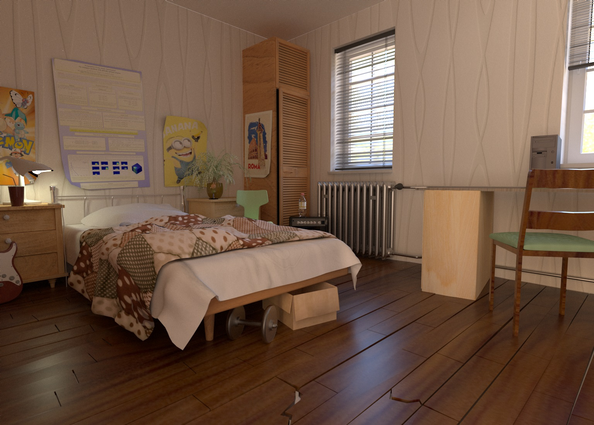
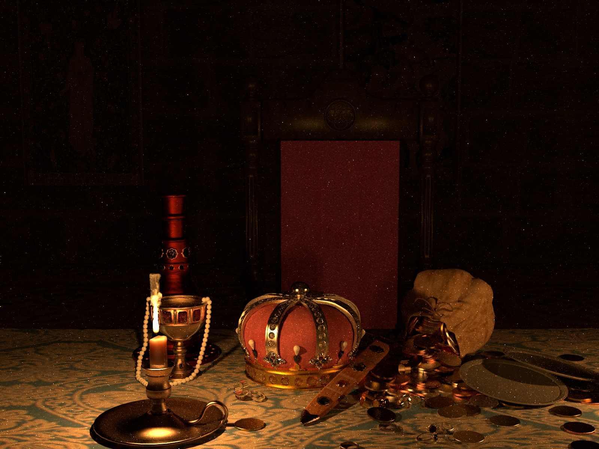

||
 |
|:---:|:---:|
| Bedroom scene from  <a href="http://forums.cgsociety.org/t/lighting-challenge-21-the-bedroom/1382064">3dRender</a> | King's treasure scene from <a href="http://forums.cgsociety.org/t/lighting-challenge-19-the-kings-treasure/1313195">3dRender</a> | 

Physically based renderer, written in C++11. It comes with a strong inspiration from [PBRT](https://www.pbrt.org/), [Mitsuba](https://www.mitsuba-renderer.org/) and [Nori](https://wjakob.github.io/nori/), from which it follows the same design ideas.   

## Features  
-Fully multithreaded (CPU) on available cores  
-BSDF: smooth and rough metal (resp. dielectric), bump / normal mapping, car paint, lambertian, multi layered, mirror, shadow catcher...  
-BSSRDF: fast dipole model  
-Textures: image (png, bmp, jpeg, OpenEXR support), Perlin noise based  
-Basic tone mapping  
-Lights: area, point, spot lights, environment map  
-Spectral / RGB handling  
-Samplers: random, stratified  
-Rendering algorithms: direct, multiple importance sampling path tracing  
-Participating media: homogeneous, heterogenous, emissive medium  
-Volumes: Mitsuba grid, openVDB volume  
-Shapes: cube, sphere, triangle mesh, plane, implicit surfaces (currently, only extended to the mandelbulb fractal)  
 
